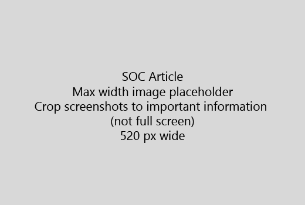

เริ่มบทความของคุณ ด้วยการแนะนำแบบสั้นมาก (1 ประโยค) ทำให้ตัวคุณเองในสถานที่ของผู้อ่าน - เหตุใดพวกเขาที่นี่หรือไม่ พวกเขาควรทำอะไรได้บ้างStart your article with a very short introduction (1 sentence). Put yourself in the reader's place - why are they here? What should they do? 
  
1. ได้รับตรงไปยังรายการอย่างรวดเร็วของขั้นตอนในการทำงานGet straight to a quick list of steps to accomplish the task.
    
    ถ้าคุณจำเป็นต้องอธิบายแนวคิดเป็น หรือจะต้องทำตามขั้นตอนที่จำเป็นล่วงหน้า เพิ่มสรุปด่วนใต้ขั้นตอนที่จำเป็นนั้น และ[เชื่อมโยง](https://support.office.com/article/f37e7984-cf03-4fde-92d3-82970d7e241b.aspx)ไปยังแนวคิดหรือขั้นตอนIf you need to explain a concept, or they have to do pre-requisite steps, add a quick summary below the step where they need it, and [link](https://support.office.com/article/f37e7984-cf03-4fde-92d3-82970d7e241b.aspx) to the concept or steps. 
    
2. รักษาขั้นตอนสั้น - ขั้นตอนที่ 5 ควรเป็นบริเวณ หรือน้อยกว่า ไม่เกิน 8Keep procedures short - preferably 5 or fewer steps, no more than 8.
    
3. ใช้**ลักษณะ Ui**สำหรับองค์ประกอบของอินเทอร์เฟซสำหรับผู้ใช้ หรือสำหรับข้อความ บุคคลที่จำเป็นต้องป้อนUse **Ui style** for user interface elements or for text people need to enter. 
    
4. ใช้กริยาเลือก เลือก หรือป้อนการดำเนินการ และการจัดรูปแบบเมนูเป็น**เมนู** \> **คำสั่ง**Use the verbs choose, select, or enter as actions, and format menus as **Menu** \> **Command**.
    
5. อีกทางหนึ่งคือ เพิ่มภาพจับสำหรับบริบท (ถ้า UI จะยากต่อการค้นหา หรือนั้นมีความจำเป็นเพื่อทำงาน)Optionally, add a screenshot for context (if UI is hard to locate, or it's needed to complete the task).
    
    ความกว้างสูงสุด: 520 พิกเซล ใช้รูปแบบมาตรฐาน ไม่ต้องแสดงข้อมูลส่วนบุคคลใด ๆ และการครอบตัดเพื่อแสดงเฉพาะ สิ่งที่เกี่ยวข้องMaximum width: 520 pixels. Use a standard theme, do not show any personal information, and crop to show only what's relevant. 
    
    
  
ถ้าคุณต้องการเพิ่มวิดีโอหรือจับภาพหน้าจอ ใช้เส้นตารางแบบสองคอลัมน์ และมีขั้นตอนในด้านซ้าย และวิดีโอหรือการจับภาพหน้าจอในด้านขวา - ดู[ขั้นตอนและตัวอย่างการแสดงผลกริด](https://support.office.com/article/14ce8e82-efa0-47f5-bb84-94f078db3dae.aspx)If you want to add a video or screenshot, use a two-column grid and have the steps in the left and the video or screenshot in the right - see [Steps and video grid example](https://support.office.com/article/14ce8e82-efa0-47f5-bb84-94f078db3dae.aspx). 
  
เป้าหมายไม่เกิน 500 คำสำหรับบทความTarget no more than 500 words for an article.
  
# บทความตัวอย่างExample article

[เปลี่ยนรูปถ่ายของฉันChange my photo](https://support.office.com/article/555376e0-1fca-49ba-8434-307a0525c767.aspx)
  

