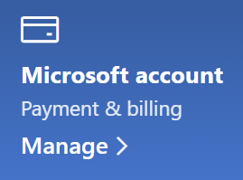

# เปลี่ยนข้อมูลบัญชี Microsoft ของฉัน

ไปที่ [https://account.microsoft.com](https://account.microsoft.com/) แล้วลงชื่อเข้าใช้ถ้าจำเป็น การดำเนินการนี้จะนำคุณไปยังแดชบอร์ดบัญชีผู้ใช้ของคุณ  

**แก้ไขชื่อและข้อมูลส่วนตัวของฉัน**

1. บนแดชบอร์ดบัญชีผู้ใช้ของคุณที่อยู่ถัดจากรูปภาพและชื่อของบัญชีผู้ใช้ของคุณให้คลิก**การดำเนินการเพิ่มเติม > แก้ไขโปรไฟล์**
2. บนหน้า **แก้ไขโพรไฟล์** ให้ใช้ลิงก์ที่มีให้เพื่อเปลี่ยนรูปภาพของโพรไฟล์ชื่อวันเดือนปีเกิดสถานที่และการกำหนดลักษณะภาษาที่แสดง หมายเหตุลิงก์ไปยังโปรไฟล์บัญชีผู้ใช้ Xbox หรือ Skype ของคุณซึ่งคุณสามารถเปลี่ยนแปลงรายละเอียดเฉพาะกับบัญชีผู้ใช้เหล่านี้ได้

**จัดการที่อยู่อีเมลและหมายเลขโทรศัพท์**

บัญชี Microsoft มีที่อยู่อีเมลหรือหมายเลขโทรศัพท์ที่เชื่อมโยงกับ "นามแฝง" อย่างน้อยหนึ่งรายการ เมื่อต้องการจัดการเหล่านี้ให้ดำเนินการดังนี้

1. บนแดชบอร์ดบัญชีผู้ใช้ของคุณที่อยู่ถัดจากรูปภาพและชื่อของบัญชีผู้ใช้ของคุณให้คลิก**การดำเนินการเพิ่มเติม > แก้ไขโปรไฟล์**
2. บนหน้า**แก้ไขโปรไฟล์**ให้คลิก**จัดการวิธีที่คุณลงชื่อเข้าใช้ Microsoft** 
3. คุณจะเห็นรายการนามแฝงของบัญชีผู้ใช้และคุณสามารถจัดการรายการรวมถึงการเพิ่มและการลบที่อยู่อีเมลและหมายเลขโทรศัพท์ได้ ที่นี่คุณยังสามารถเลือกนามแฝงที่สามารถใช้เพื่อลงชื่อเข้าใช้บัญชีผู้ใช้และนามแฝงที่ถือว่า "หลัก" ซึ่งจะแสดงบนอุปกรณ์ Windows 10 ของคุณ

**จัดการวิธีการชำระเงินรวมถึงชื่อและที่อยู่สำหรับการเรียกเก็บเงิน** 

1. บนแดชบอร์ดบัญชีผู้ใช้ของคุณที่อยู่ถัดจากรูปภาพและชื่อของบัญชีผู้ใช้ของคุณให้คลิก**การดำเนินการเพิ่มเติม > แก้ไขโปรไฟล์**
2. ภายใต้**การชำระเงิน & การเรียกเก็บ**เงินให้คลิก**จัดการ**

    

3. ที่นี่คุณสามารถเพิ่มแก้ไขและลบวิธีการชำระเงินและที่อยู่การเรียกเก็บเงินที่เกี่ยวข้อง 
