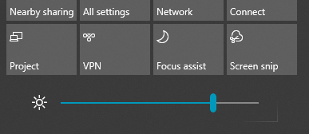

# เปลี่ยนความสว่างของหน้าจอใน Windows 10

ถ้า Windows 10 ของคุณใหม่กว่ารุ่น 1903 จะมี**แถบเลื่อนความสว่าง**ในศูนย์ปฏิบัติการ เมื่อต้องการเปิดศูนย์ปฏิบัติการ ให้คลิกปุ่ม**การแจ้งเตือน**ที่ด้านขวาสุดของแถบงาน หรือกด**หน้าแรกของ Windows + A**บนแป้นพิมพ์ของคุณ

หาก Windows 10 ของคุณเป็นรุ่นก่อนหน้าคุณสามารถค้นหาแถบเลื่อนความสว่างได้โดยไปที่ การตั้งค่า > ระบบ**[> จอแสดงผล](ms-settings:display?activationSource=GetHelp)**

**หมายเหตุ**:

- คุณอาจไม่เห็นแถบเลื่อนเปลี่ยนความสว่างสําหรับจอแสดงผลในตัวบนพีซีเดสก์ท็อปที่มีจอภาพภายนอก เมื่อต้องการเปลี่ยนความสว่างของจอภาพภายนอก ให้ใช้ตัวควบคุมบนจอภาพ
- ถ้าคุณไม่มีพีซีเดสก์ท็อป และแถบเลื่อนไม่ปรากฏขึ้นหรือทํางาน ให้ลองปรับปรุงโปรแกรมควบคุมจอแสดงผล ในกล่องค้นหาบนแถบงาน ให้พิมพ์**ตัวจัดการอุปกรณ์**แล้วเลือก**ตัวจัดการอุปกรณ์**จากรายการผลลัพธ์ ใน**Device Manager**ให้เลือก**การ์ดแสดงผล**จากนั้นเลือกการ์ดแสดงผล กดค้าง (หรือคลิกขวา) ที่ชื่อการ์ดแสดงผล แล้วคลิก**อัพเดตไดรเวอร์**; จากนั้นทําตามคําแนะนํา
