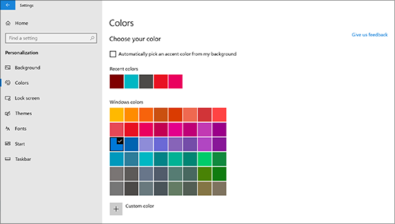
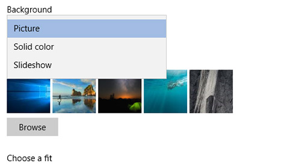

# เปลี่ยนพื้นหลังและสีของเดสก์ท็อป

เมื่อต้องการเปลี่ยนการตั้งค่าสีของคุณ **ให้ไปที่**  >  **เริ่ม การตั้งค่า**  >  **สีการตั้งค่า** ส่วนบุคคล แล้วเลือกสีของคุณเอง หรือ  >  ให้ Windows ดึงโทนสีจากพื้นหลังของคุณ

เมื่อต้องการเปลี่ยนพื้นหลังของเดสก์ท็อป **ให้ไปที่**  >  **เริ่ม การตั้งค่า**  >  **พื้นหลังการตั้งค่า** ส่วนบุคคล แล้วเลือกรูปภาพ สี  >  ทึบ หรือสร้างการสไลด์รูปภาพ 

ต้องการพื้นหลังและสีของเดสก์ท็อปเพิ่มเติมใช่ไหม เยี่ยมชม[Microsoft Store](https://www.microsoft.com/store/collections/windowsthemes)ธีมฟรีมากมายให้เลือกใช้
