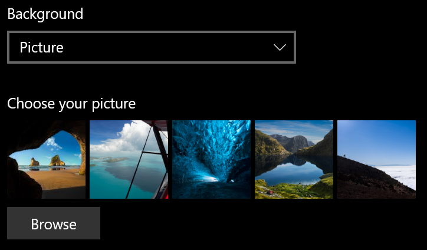
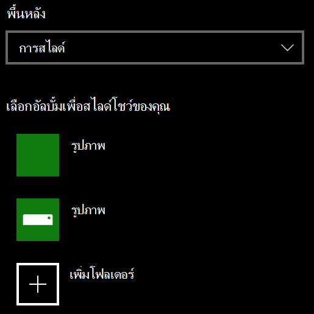

# เปลี่ยนพื้นหลังหน้าจอเมื่อล็อก

- ไปที่ **การตั้งค่า**  >  **ล็อก**  >  **การตั้งค่า** ส่วนบุคคล หรือคลิกหรือ [แตะ](ms-settings:lockscreen?activationSource=GetHelp)ที่นี่

- เมื่อต้องการตั้งค่ารูปภาพพื้นหลังแบบ **ปรับแต่งเอง** ให้เลือก รูปภาพ **จากรายการ** ดรอปดาวน์ พื้นหลัง แล้วเลือก **หรือ** เรียกดูรูปภาพ

  

- เมื่อต้องการตั้งค่าการสไลด์ของรูปภาพ **แบบปรับแต่งเอง** ให้เลือก การสไลด์ สไลด์ จากรายการดรอปดาวน์ พื้นหลัง แล้วเลือกอัลบั้มหรือเพิ่มโฟลเดอร์ที่มีรูปภาพของการสไลด์

  
