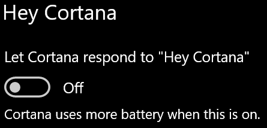

# Cortanaไม่พูดกับฉัน หรือไม่ได้ยินฉัน

ถ้าคุณพยายามใช้ฟีเจอร์ "สวัสดี Cortana" ซึ่งอนุญาตให้คุณพูดคุยกับ Cortana โดยไม่ต้องเลือกปุ่ม Cortana บนแถบงานหรือปุ่มไมโครโฟนในแผง Cortana ให้ยืนยันว่าเปิดใช้งานฟีเจอร์:

1. **ไปที่** เริ่มต้น จากนั้นเลือก **[การตั้งค่า > Cortana](ms-settings:cortana?activationSource=GetHelp)**
2. ภายใต้ **สวัสดี Cortana** สลับ **ปุ่มสลับ ให้Cortanaตอบกลับ "สวัสดีCortana"** **เป็น** เปิด

**การตั้งค่าความเป็นส่วนตัวของคุณป้องกันไม่ให้Cortanaได้ยินคุณหรือไม่**

การตั้งค่าความเป็นส่วนตัวของคุณสามารถCortanaไม่ตอบสนองต่อเสียงของคุณ
- ตรวจสอบว่าได้เปิด การรู้รู้ช่วยเสียงแบบออนไลน์ แล้ว:
    - ไปที่ **เริ่มต้น** จากนั้นคลิก ปุ่มการตั้งค่า >**[ความเป็นส่วนตัว>สั่งงานด้วยเสียง](ms-settings:privacy-speech?activationSource=GetHelp)**
    - ภายใต้ **การรู้รู้ช่วย** เสียงออนไลน์ ให้สลับ **การตั้งค่าเป็น** เปิด
- ตรวจสอบให้แน่ใจว่าCortanaมีสิทธิ์เข้าถึงไมโครโฟนของคุณ 
    - ไปที่ เริ่ม แล้วคลิกการตั้งค่า >**[ความเป็นส่วนตัว>](ms-settings:privacy-microphone?activationSource=GetHelp)** ไมโครโฟน
    - **ภายใต้ เลือกแอปที่สามารถเข้าถึง** ไมโครโฟนCortana ค้นหาภายในรายการแอปและบริการ ต่างๆ และตรวจสอบให้แน่ใจว่าสวิตช์สลับ **เป็น** เปิด

นอกจากนี้ โปรดตรวจสอบให้แน่ใจว่าลําโพงหรือไมโครโฟนของคุณใช้งานได้และใช้งานได้เพื่อพูดคุยกับCortanaของคุณ
