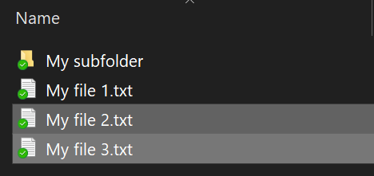
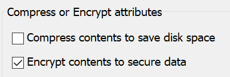

# เข้ารหัสลับแฟ้มหรือโฟลเดอร์ใน Windows 10Encrypt files or folder in Windows 10

คุณสามารถเข้ารหัสลับดิสก์ทั้งหมดโดยใช้ BitLocker ได้ แต่การเข้ารหัสลับเฉพาะแฟ้มหรือโฟลเดอร์แต่ละโฟลเดอร์เท่านั้น (และเนื้อหาเหล่านั้น)You can encrypt an entire disk using BitLocker, but to encrypt only individual files or folders (and their contents):

1. ใน**File Explorer**ให้เลือกแฟ้ม/โฟลเดอร์ที่คุณต้องการเข้ารหัสIn **File Explorer**, select the file(s)/folder(s) you want to encrypt. ในตัวอย่างนี้ได้เลือกไฟล์สองไฟล์:In this example, two files have been selected:

    

2. คลิกขวาที่แฟ้มที่เลือก และคลิก**คุณสมบัติ**Right-click the selected files and click **Properties**.

3. ในหน้าต่าง**คุณสมบัติ**ให้คลิก**ขั้นสูง**In the **Properties** window, click **Advanced**.

4. ในหน้าต่าง**คุณสมบัติขั้นสูง**ให้เลือกกล่องกาเครื่องหมาย**เข้ารหัสเนื้อหาเพื่อรักษาความปลอดภัยข้อมูล**In the **Advanced Properties** window, select the **Encrypt contents to secure data** checkbox:

    

5. คลิก **OK**Click **OK**.
