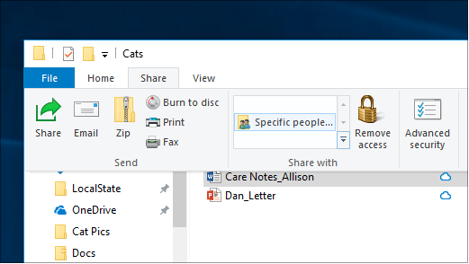
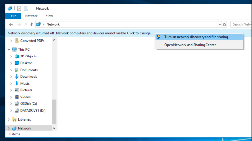

# การแชร์ไฟล์บนเครือข่ายใน Windows 10

**หมายเหตุ**: หากก่อนหน้านี้คุณเคยใช้โฮมกรุ๊ปเพื่อแชร์ไฟล์ โปรดทราบว่าโฮมกรุ๊ปถูกเอาออกจาก Windows 10 (เวอร์ชัน 1803) คุณสามารถแชร์เครื่องพิมพ์และไฟล์โดยใช้คุณลักษณะที่มีอยู่แล้วภายใน Windows 10 ได้แล้ว

**เมื่อต้องการแชร์ไฟล์หรือโฟลเดอร์บนเครือข่าย**

- ใน **File Explorer** ให้เลือกไฟล์> คลิกแท็บ แชร์ที่>ในส่วน **แชร์** กับ ให้คลิก **บุคคล** ที่ระบุ

    
          
- ถ้าคุณเลือกหลายไฟล์ในครั้งเดียว คุณสามารถแชร์ไฟล์เหล่านั้นทั้งหมดได้ด้วยวิธีเดียวกัน ใช้ได้กับโฟลเดอร์เช่นกัน

**เมื่อต้องการดูอุปกรณ์บนเครือข่ายที่ใช้ไฟล์ร่วมกัน**

- ใน **File Explorer****ให้ไปที่** เครือข่าย ถ้าการค้นพบเครือข่ายไม่ได้เปิดใช้งาน คุณจะเห็นข้อความแสดงข้อผิดพลาด "การค้นพบเครือข่ายปิดอยู่..."

- คลิก **แบนเนอร์ ค้นหาเครือข่าย ปิด** อยู่ จากนั้นคลิก **เปิดการค้นหาเครือข่ายและการแชร์** ไฟล์

    

[อ่านเพิ่มเติมเกี่ยวกับการแชร์ไฟล์บนเครือข่าย](https://support.microsoft.com/help/4092694/windows-10-file-sharing-over-a-network)

[แชร์ไฟล์โดยใช้แอป OneDrive อีเมล และอื่นๆ](https://support.microsoft.com/help/4027674/windows-10-share-files-in-file-explorer)
