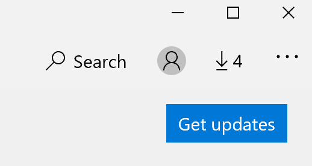

# แก้ไขภาษาที่ใช้แสดงของแอป

หลังจากที่คุณเปลี่ยนภาษาที่ใช้แสดงใน Windows 10 แอพบางอย่างอาจยังคงใช้ภาษาก่อนหน้านี้เมื่อคุณเปิดใช้งาน สิ่งนี้เกิดขึ้นเนื่องจากแอปเวอร์ชันใหม่สำหรับภาษานั้นต้องถูกดาวน์โหลดจาก Store เมื่อต้องการแก้ไขปัญหานี้คุณสามารถรอการอัปเดตอัตโนมัติหรือคุณสามารถติดตั้งแอปเวอร์ชันที่อัปเดตแล้วด้วยตนเองได้

เมื่อต้องการติดตั้งการอัปเดตด้วยตนเองให้เปิด **Microsoft Store** แล้วคลิก **ดาวน์โหลดและอัปเดต** ที่มุมบนขวา จากนั้นคลิก**รับการอัปเดต** ถ้าไม่มีการเปลี่ยนแปลงภาษาหลังจากการอัปเดตเป็นเสร็จสมบูรณ์ให้ลองเริ่มต้นระบบพีซีของคุณใหม่

เมื่อต้องการอ่านเพิ่มเติมเกี่ยวกับการตั้งค่าการป้อนข้อมูลและการแสดงภาษาให้ดู[ที่จัดการการตั้งค่าภาษาสำหรับการป้อนค่าและการแสดงผลของคุณใน Windows 10](https://support.microsoft.com/help/4027670/windows-10-add-and-switch-input-and-display-language-preferences)
