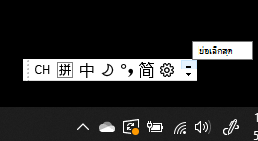
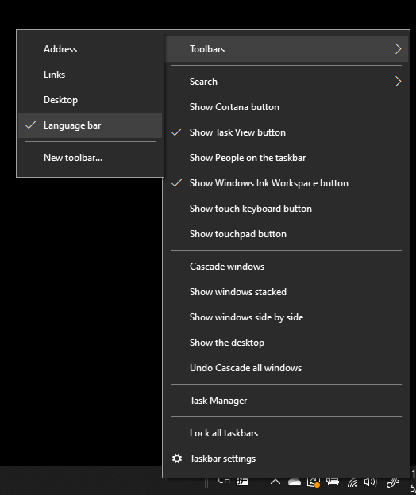
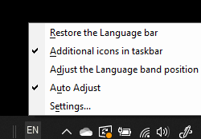

# ซ่อน แสดง หรือตั้งค่าแถบภาษาใหม่Hide, display, or reset the language bar

**เมื่อต้องการย่อแถบภาษาให้เล็กสุด:****To minimize the language bar:**

คุณสามารถคลิกปุ่มย่อเล็กสุดที่มุมขวาบนของแถบภาษาYou can click the minimize button on the top right corner of the language bar. หรือคุณสามารถลากแถบภาษาไปยังแถบงานซึ่งจะย่อโดยอัตโนมัติOr, you can just drag the language bar to the task bar, which will automatically minimize it.

**เมื่อต้องการแสดงแถบภาษา:****To pop out the language bar:**

ถ้าคุณไม่ต้องการเทียบชิดแถบภาษาในแถบงาน ให้คลิกขวาที่พื้นที่ว่างในแถบงาน และยกเลิกการเลือกตัวเลือก**แถบภาษา**ในเมนู แถบเครื่องมือIf you don't want to dock the language bar in the taskbar, right-click any empty space in the taskbar, and uncheck the **Language bar** option in the Toolbars menu. การทําเช่นนี้จะทําให้แถบภาษาปรากฏอยู่นอกแถบงานเช่นเดียวกับภาพหน้าจอก่อนหน้าThis will make the language bar appear outside the taskbar, just like the previous screenshot.

**เมื่อต้องการคืนค่าแถบภาษาเป็นค่าเริ่มต้น:****To restore the language bar to default:**

คลิกขวาที่ปุ่มภาษาในแถบเครื่องมือ แล้วคลิก**คืนค่าตัวเลือกแถบภาษา**ในเมนูRight-click the language button in the toolbar, and click **Restore the language bar** option in the menu. การดําเนินการนี้จะคืนค่ากลับไปเป็นค่าดีฟอลต์This will restore it to default.

