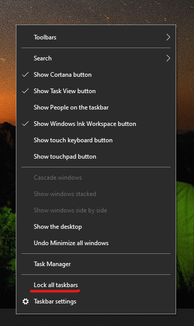

# ย้ายแถบงานไปยังด้านใดด้านหนึ่งหรือด้านบนของเดสก์ท็อปของคุณMove the taskbar to either side or the top of your desktop

ก่อนอื่นโปรดยืนยันว่าแถบงานถูกปลดล็อกFirst, please confirm that the taskbar is unlocked. เมื่อต้องการทราบว่าคุณได้ล็อกแล้วหรือไม่ให้คลิกขวาที่พื้นที่ว่างใดๆบนแถบงานและดูว่า **ล็อกแถบงาน** มีเครื่องหมายถูกอยู่ข้างๆหรือไม่To find out whether yours is unlocked, right-click any empty space on the taskbar and see whether **Lock the taskbar** has a checkmark next to it. ถ้ามีเครื่องหมายถูกแถบงานถูกล็อกและไม่สามารถย้ายได้If there is a checkmark, the taskbar is locked and cannot be moved. คลิก **ล็อกแถบงานเมื่อต้อง** การปลดล็อกแถบงานแล้วเอาเครื่องหมายออกClicking **Lock the taskbar** once will unlock it and remove the checkmark.

ถ้าคุณมีหลายจอภาพที่แสดงแถบงานคุณจะเห็น**ล็อกแถบงานทั้งหมด**If you have multiple monitors that display the taskbar, you will see **Lock all taskbars**.

เมื่อแถบงานถูกปลดล็อกแล้วคุณสามารถกดพื้นที่ว่างบนแถบงานค้างไว้แล้วลากไปยังตำแหน่งที่คุณต้องการบนหน้าจอได้Once the taskbar is unlocked, you can press and hold any empty space on the taskbar and drag it to the location you want on the screen. นอกจากนี้คุณยังสามารถทำได้ด้วยการคลิกขวาที่พื้นที่ว่างบนแถบงานแล้วไปที่**[การตั้งค่าแถบ](ms-settings:taskbar?activationSource=GetHelp)งาน > ตำแหน่งที่ตั้งของแถบงานบนหน้าจอ**You can also do so by right-clicking on any empty space on the taskbar and go to **[Taskbar settings](ms-settings:taskbar?activationSource=GetHelp) > Taskbar location on screen**.
