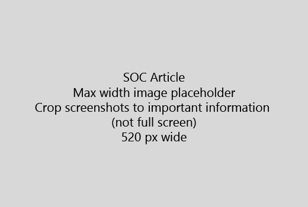

เริ่มบทความของคุณ ด้วยการแนะนำแบบสั้นมาก (1 ประโยค) ทำให้ตัวคุณเองในสถานที่ของผู้อ่าน - เหตุใดพวกเขาที่นี่หรือไม่ พวกเขาควรทำอะไรได้บ้าง 
  
1. ได้รับตรงไปยังรายการอย่างรวดเร็วของขั้นตอนในการทำงาน
    
    ถ้าคุณจำเป็นต้องอธิบายแนวคิดเป็น หรือจะต้องทำตามขั้นตอนที่จำเป็นล่วงหน้า เพิ่มสรุปด่วนใต้ขั้นตอนที่จำเป็นนั้น และ[เชื่อมโยง](https://support.office.com/article/f37e7984-cf03-4fde-92d3-82970d7e241b.aspx)ไปยังแนวคิดหรือขั้นตอน 
    
2. รักษาขั้นตอนสั้น - ขั้นตอนที่ 5 ควรเป็นบริเวณ หรือน้อยกว่า ไม่เกิน 8
    
3. ใช้**ลักษณะ Ui**สำหรับองค์ประกอบของอินเทอร์เฟซสำหรับผู้ใช้ หรือสำหรับข้อความ บุคคลที่จำเป็นต้องป้อน 
    
4. ใช้กริยาเลือก เลือก หรือป้อนการดำเนินการ และการจัดรูปแบบเมนูเป็น**เมนู** \> **คำสั่ง**
    
5. อีกทางหนึ่งคือ เพิ่มภาพจับสำหรับบริบท (ถ้า UI จะยากต่อการค้นหา หรือนั้นมีความจำเป็นเพื่อทำงาน)
    
    ความกว้างสูงสุด: 520 พิกเซล ใช้รูปแบบมาตรฐาน ไม่ต้องแสดงข้อมูลส่วนบุคคลใด ๆ และการครอบตัดเพื่อแสดงเฉพาะ สิ่งที่เกี่ยวข้อง 
    
    
  
ถ้าคุณต้องการเพิ่มวิดีโอหรือจับภาพหน้าจอ ใช้เส้นตารางแบบสองคอลัมน์ และมีขั้นตอนในด้านซ้าย และวิดีโอหรือการจับภาพหน้าจอในด้านขวา - ดู[ขั้นตอนและตัวอย่างการแสดงผลกริด](https://support.office.com/article/14ce8e82-efa0-47f5-bb84-94f078db3dae.aspx) 
  
เป้าหมายไม่เกิน 500 คำสำหรับบทความ
  
# บทความตัวอย่าง

[เปลี่ยนรูปถ่ายของฉัน](https://support.office.com/article/555376e0-1fca-49ba-8434-307a0525c767.aspx)
  

