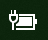

# ไอคอน Power หรือแบตเตอรีหายไปใน Windows 10Power or battery icon missing in Windows 10

ถ้าอุปกรณ์ Windows 10 ของคุณมีแบตเตอรี่ (เช่นแล็ปท็อปหรือแท็บเล็ตหรือพีซีที่เชื่อมต่อผ่าน USB กับ UPS) โดยปกติไอคอน power/แบตเตอรี่จะแสดงอยู่ในแถบงานที่อยู่ใกล้กับนาฬิกาตัวอย่างเช่น:If your Windows 10 device has a battery (e.g., laptop or tablet, or a PC connected via USB to a UPS), normally a power/battery icon is shown in the taskbar near the clock, for example:

ถ้าคุณไม่เห็นไอคอนนี้แสดงว่าไอคอนดังกล่าวอาจถูกซ่อนไว้:If you don't see this icon, it may be hidden:

1. ไปที่**[การตั้งค่า > > แถบงานการตั้งค่าส่วนบุคคล](ms-settings:taskbar?activationSource=GetHelp)**Go to **[Settings > Personalization > Taskbar](ms-settings:taskbar?activationSource=GetHelp)**.

2. ในพื้นที่การแจ้งให้ทราบให้คลิก**เลือกไอคอนที่ปรากฏบนแถบงาน**In the Notification area, click **Select which icons appear on the taskbar**.

3. จากนั้นค้นหารายการ**พลังงาน**ในรายการและสลับการตั้งค่าเป็น**เปิด**Then find the **Power** item in the list and toggle its setting to **On**.

    

**การแก้ไขปัญหา****Troubleshooting**

ถ้าคุณทำตามคำแนะนำข้างต้นและสวิตช์ **Power** จะเป็นสีเทาหรือไม่ปรากฏในกล่องค้นหาบนแถบงานให้พิมพ์ **ตัวจัดการอุปกรณ์**แล้วเลือก **ตัวจัดการอุปกรณ์** ในรายการผลลัพธ์If you followed the above instructions and the **Power** toggle is greyed out or not visible, in the search box on the taskbar, type **device manager**, and then select **Device Manager** in the list of results. ภายใต้**แบตเตอรี่**ให้คลิกขวาที่แบตเตอรี่สำหรับอุปกรณ์ของคุณแล้วคลิก**ปิดใช้งาน**แล้วคลิก**ใช่**Under **Batteries**, right-click the battery for your device, click **Disable**, and click **Yes**. รอสองสามวินาทีจากนั้นคลิกขวาที่แบตเตอรี่แล้วคลิก**เปิดใช้งาน**Wait a few seconds, and then right-click the battery and click **Enable**. จากนั้นรีสตาร์ตอุปกรณ์ของคุณThen restart your device.

ถ้าคุณทำตามคำแนะนำข้างต้นแต่ไอคอนแบตเตอรีไม่ปรากฏบนแถบงานในกล่องค้นหาบนแถบงานให้พิมพ์ **ตัวจัดการงาน**แล้วคลิก **ตัวจัดการงาน** ในรายการผลลัพธ์If you followed the above instructions, but the battery icon does not appear on the taskbar, in the search box on the taskbar, type **task manager**, and then click **Task Manager** in the list of results. บนแท็บ**กระบวนการ**ภายใต้**ชื่อ**ให้คลิกขวาที่**Explorer**แล้วคลิก**เริ่มใหม่**On the **Processes** tab, under **Name**, right-click **Explorer**, and then click **Restart**.
