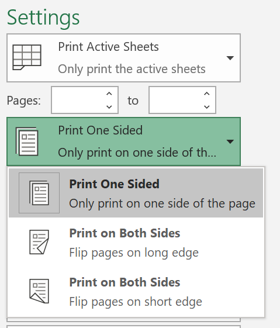
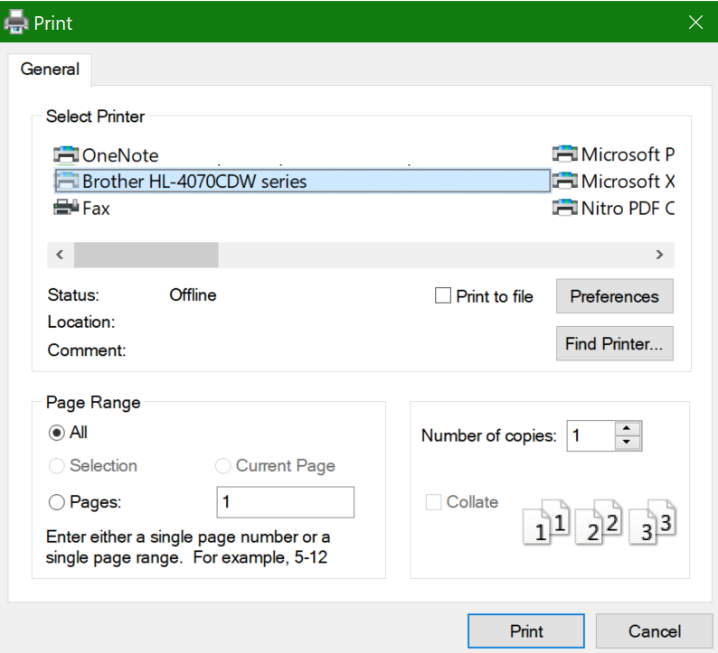

# การพิมพ์บนกระดาษทั้งสองด้าน (การพิมพ์สองด้าน)Printing on both sides of paper (duplex printing)

**เครื่องพิมพ์ของฉันสามารถพิมพ์แบบสองด้านได้หรือไม่****Is my printer capable of duplex printing?**

สรุปฟีเจอร์ของเครื่องพิมพ์หรือคู่มือควรบอกคุณว่าสามารถพิมพ์บนกระดาษทั้งสองด้าน หรือที่เรียกว่า "การพิมพ์แบบสองด้าน" หรือไม่Your printer’s feature summary or manual should tell you whether it is capable of printing on both sides of the paper, also known as “duplex printing.” ถ้าคุณมี Microsoft Office อีกวิธีหนึ่งในการค้นหาคือการเปิดแอป Office เช่น Word หรือ Excel ไปที่ ไฟล์ **>** พิมพ์ ตรวจสอบให้แน่ใจว่าเลือกเครื่องพิมพ์ที่ถูกต้องแล้ว และค้นหาความสามารถในส่วน การตั้งค่าIf you have Microsoft Office, another way to find out is by opening an Office app like Word or Excel, going to **File > Print**, making sure the right printer is selected, and looking for the capability in the Settings section. ตัวอย่างเช่น:For example: 

**การพิมพ์แบบสองด้านใน Microsoft Office****Duplex printing in Microsoft Office**

ถ้าเครื่องพิมพ์ของคุณสามารถพิมพ์ทั้งสองด้านได้ เมื่อคุณไปที่ ไฟล์ **>** พิมพ์ ในแอป Office คุณจะเห็นตัวเลือกเป็น "พิมพ์ทั้งสองด้าน" ตามที่แสดงในตัวอย่างด้านบนIf your printer is capable of printing on both sides, when you go to **File > Print** in the Office app, you will see an option to “Print on Both Sides,” as shown in the example above.  เลือกชนิดของการพิมพ์แบบสองด้านที่คุณต้องการ (พลิกด้านยาว หรือพลิกตามแนวยาว) **แล้วคลิก** พิมพ์ เพื่อเริ่มสิ่งพิมพ์Select the type of duplex printing you want (flip on long edge, or flip on short edge), and click **Print** to start the printout.

**การพิมพ์แบบสองด้านจากทุกแอปพลิเคชัน****Duplex printing from any application**

ในหลายแอปเมื่อคุณพิมพ์ คุณจะเห็นกล่องโต้ตอบการพิมพ์ทั่วไปที่มีลักษณะดังนี้:In many apps when you print you will see a general print dialog that looks like this: 

ตรวจสอบให้แน่ใจว่าเลือกเครื่องพิมพ์ที่ถูกต้อง จากนั้นคลิก การ **กล่างลักษณะ** เพื่อเปิดหน้าต่างการกล่างลักษณะของเครื่องพิมพ์Make sure the right printer is selected, then click **Preferences** to open the printer preferences window. ถ้าเครื่องพิมพ์สามารถพิมพ์แบบสองด้านได้ ความสามารถในการเปิดใช้งานสิ่งนี้กับงานพิมพ์ปัจจุบันจะแสดงในหน้าต่างนั้นIf the printer is capable of duplex printing, the ability to enable this for the current print job will show in that window.
