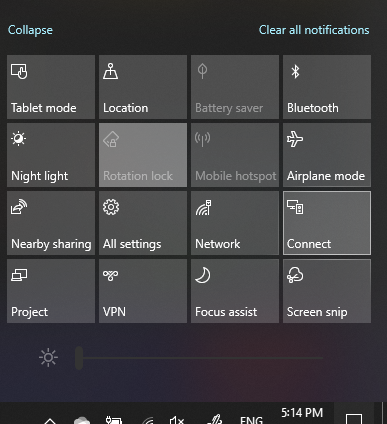

# Projectไปยังพีซี

บนอุปกรณ์ปลายทางของคุณ (การฉายภาพไปยัง) ให้ค้นหา "การฉายการตั้งค่า" เพื่อเปิดการตั้งค่า **หน้าการฉายภาพไปยังพีซี** นี้ จากนั้นตรวจสอบให้แน่ใจว่า:
- "อุปกรณ์ Windows Android บางรุ่นสามารถฉายภาพไปยังพีซีเครื่องนี้เมื่อคุณบอกว่าเป็นตกลง" เมนูดรอปดาวน์ถูกตั้งค่าเป็น **ปิด** เสมอ
- เมนูดรอปดาวน์ "ขอให้ฉายภาพไปยังพีซีเครื่องนี้"**ถูกตั้งค่าเป็น ทุกครั้งที่ต้องมีการเชื่อมต่อ**
- เมนูดรอปดาวน์ "ต้องใช้ PIN ในการจับคู่" ถูกตั้งค่า **เป็น** ไม่

บนอุปกรณ์ปลายทาง ให้เปิดใช้ **เชื่อมต่อ** แอป **โดยไปที่หน้าจอ** เริ่ม และค้นหา "เชื่อมต่อ"

จากนั้น บนอุปกรณ์ต้นทางของคุณที่คุณพยายามฉายภาพจาก:

1. กดแป้น **Windows + A** เพื่อเปิด ศูนย์ปฏิบัติการ
2. คลิก **เชื่อมต่อ**
3. คลิกอุปกรณ์ที่คุณต้องการฉายภาพหน้าจอ

หลังจากขั้นตอนข้างต้น อุปกรณ์ปลายทางของคุณควรแสดงหน้าจอของอุปกรณ์ต้นทางเหมือนกับเป็นจอภาพรอง
