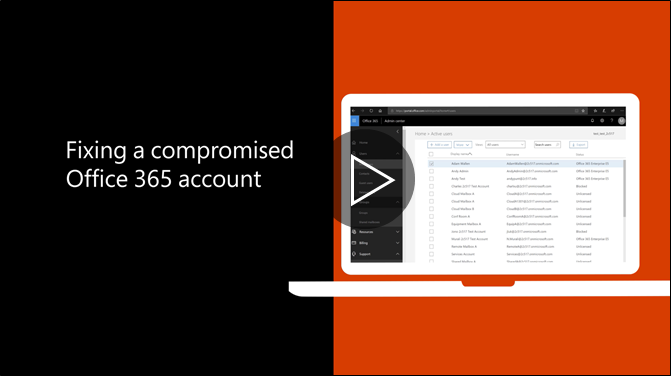

# ขั้นตอนที่แนะนำจะกระทำถ้าบัญชีผู้ใช้ถูกละเมิด

  
1. [ตั้งค่ารหัสผ่านของผู้ใช้](https://support.office.com/article/7a5d073b-7fae-4aa5-8f96-9ecd041aba9c)ทันที สื่อสารผ่านใหม่ผ่านทางอีเมลของผู้ใช้ 
    
2. เอาใด ๆ น่าสงสัย[ที่อยู่การส่งต่อ](https://support.office.com/article/ab5eb117-0f22-4fa7-a662-3a6bdb0add74)การตั้งค่าที่ระดับกล่องจดหมาย 
    
3. เอาน่าสงสัยใด ๆ[กฎขา](https://support.office.com/article/1433E3A0-7FB0-4999-B536-50E05CB67FED)ตั้งภายในกล่องจดหมาย 
    
4. ถ้าผู้ใช้ที่ถูกบล็อคจากการส่งอีเมล[ไปยังผู้ใช้ยกเลิกการบล็อกบัญชีผู้ใช้แบบจำกัด](https://protection.office.com/?hash=/restrictedusers) เมื่อทำเช่น ผู้ใช้ควรสามารถดำเนินต่อการส่งข้อความภายใน 1 ชั่วโมง
    
5. เอาบัญชีผู้ใช้จาก[กลุ่มบทบาทผู้ดูแลระบบ](https://support.office.com/article/eac4d046-1afd-4f1a-85fc-8219c79e1504)ใด ๆ จนกว่าคุณจะมั่นใจว่า บัญชีผู้ใช้ไม่ได้อีกต่อไปอาจไม่สมบูรณ์ 
    
เพื่อลดโอกาสของการรักษาข้อมูลหรือบัญชีถูกโจมตีในอนาคต ขอแนะนำให้อ่าน[บทความวิธีปฏิบัติที่ดีที่สุดของ Office 365 ปลอดภัย](https://support.office.com/article/9295e396-e53d-49b9-ae9b-0b5828cdedc3)ของเรา
  

