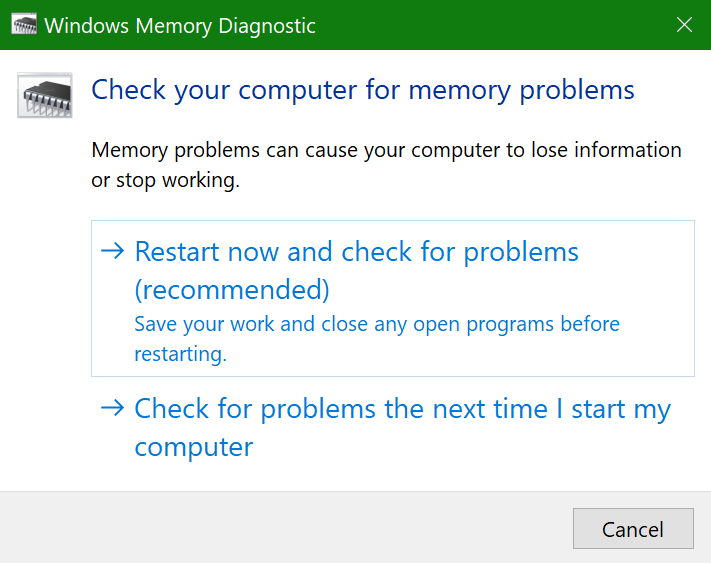
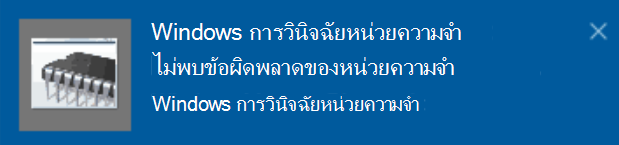

# เรียกใช้การวินิจฉัยหน่วยความจํา Windows ใน Windows 10Run Windows Memory Diagnostics in Windows 10

หาก Windows และแอปบนพีซีของคุณหยุดการหยุดหรือเกิดการผิดพลาด คุณอาจมีปัญหากับหน่วยความจําพีซี (RAM)If Windows and apps on your PC are crashing, freezing, or acting in an unstable manner, you may have a problem with the PC’s memory (RAM). คุณสามารถเรียกใช้การวินิจฉัยหน่วยความจําของ Windows เพื่อตรวจสอบปัญหาเกี่ยวกับ RAM ของพีซีYou can run the Windows Memory Diagnostic to check for problems with the PC’s RAM.

ในกล่องค้นหาบนแถบงานของคุณ พิมพ์ การวินิจฉัย **หน่วยความ** จํา แล้วเลือก **การวินิจฉัยหน่วยความจํา Windows**In the search box on your taskbar, type **memory diagnostic**, and then select **Windows Memory Diagnostic**. 

เมื่อต้องการเรียกใช้การวินิจฉัย พีซีต้องรีสตาร์ตTo run the diagnostic, the PC needs to restart. คุณมีตัวเลือกในการรีสตาร์ตทันที (โปรดบันทึกงานของคุณและปิดเอกสารที่เปิดอยู่และอีเมลก่อน) หรือจัดเวลาการวินิจฉัยให้เรียกใช้โดยอัตโนมัติในครั้งถัดไปที่พีซีเริ่มระบบใหม่:You have the option to restart immediately (please save your work and close open documents and e-mails first), or schedule the diagnostic to run automatically the next time the PC restarts:

เมื่อพีซีเริ่มระบบใหม่ เครื่องมือ **การวินิจฉัยหน่วยความจํา Windows** จะเรียกใช้โดยอัตโนมัติWhen the PC restarts, the **Windows Memory Diagnostics Tool** will run automatically. สถานะและความคืบหน้าจะแสดงเป็นการเรียกใช้การวินิจฉัย และคุณจะมีตัวเลือกในการยกเลิกการวินิจฉัยโดยการกดแป้น **ESC** บนคีย์บอร์ดของคุณStatus and progress will be displayed as the diagnostics run, and you have the option of cancelling the diagnostics by hitting the **ESC** key on your keyboard.

เมื่อการวินิจฉัยเสร็จสมบูรณ์ Windows จะเริ่มตามปกติWhen the diagnostics are complete, Windows will start normally.
หลังจากเริ่มระบบใหม่ทันที เมื่อเดสก์ท็อปปรากฏขึ้น การแจ้งเตือนจะปรากฏขึ้น (ถัดจากไอคอนศูนย์ปฏิบัติการบนแถบงาน) เพื่อระบุว่าพบข้อผิดพลาดของหน่วยความจําใดๆ หรือไม่Immediately after restart, when the Desktop appears, a notification will appear (next to the **Action Center** icon on the taskbar), to indicate whether any memory errors were found. ตัวอย่างเช่น:For example:

ต่อไปนี้คือไอคอนศูนย์ปฏิบัติการ:Here's the Action Center icon:  

และตัวอย่างการแจ้งเตือน:And a sample notification: 

หากคุณไม่ได้รับการแจ้งเตือน คุณสามารถเลือก **ไอคอนศูนย์ปฏิบัติการ** บนแถบงานเพื่อแสดงรายการการแจ้งเตือนที่เลื่อนได้If you missed the notification, you can select the **Action Center** icon  on the taskbar to display the **Action Center** and see a scrollable list of notifications.

เมื่อต้องการตรวจสอบข้อมูลโดยละเอียด **ให้พิมพ์** เหตุการณ์ลงในกล่องค้นหาบนแถบงานของคุณ แล้วเลือก **ตัวแสดง** เหตุการณ์To review detailed information, type **event** into the search box on your taskbar, and then select **Event Viewer**. ในบานหน้าต่าง **ด้านซ้ายของ** ตัวแสดงเหตุการณ์ ให้นําทางไปยัง แฟ้มบันทึก **ของ Windows > System**In the **Event Viewer**’s left-hand pane, navigate to **Windows Logs > System**. ในบานหน้าต่างด้านขวามือ ให้สแกนรายการขณะที่ดูคอลัมน์ **แหล่งข้อมูล** จนกว่าคุณจะเห็นเหตุการณ์ด้วย ค่าแหล่งข้อมูล **MemoryDiagnostics-Results**In the right-hand pane, scan down the list while looking at the **Source** column, until you see events with Source value **MemoryDiagnostics-Results**. เน้นแต่ละเหตุการณ์ดังกล่าวและดูข้อมูลผลลัพธ์ในกล่องภายใต้ **แท็บ** ทั่วไป ทางด้านล่างของรายการHighlight each such event and see the result information in the box under the **General** tab below the list.
