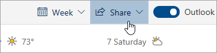

# การแชร์กับ Outlook บนเว็บ

1. ที่ด้านล่างของหน้า ให้เลือก ปฏิทิน เพื่อไปที่ปฏิทิน

2. ใน ปฏิทิน บนแถบเครื่องมือที่ด้านบนของหน้า ให้เลือก **แชร์**แล้วเลือกปฏิทินที่คุณต้องการแชร์ 

    

    **หมายเหตุ**: คุณไม่สามารถแชร์ปฏิทินที่ผู้อื่นเป็นเจ้าของได้

3. ป้อนชื่อหรือที่อยู่อีเมลของบุคคลที่คุณต้องการแชร์ปฏิทินด้วย

4. เลือกวิธีที่คุณต้องการให้บุคคลใช้ปฏิทินของคุณ: 
    - **สามารถดูได้เมื่อฉันไม่ว่าง**   ช่วยให้พวกเขาเห็นเมื่อคุณไม่ว่าง แต่ไม่ได้รวมรายละเอียดเช่นสถานที่จัดกิจกรรม 
    - **สามารถดูชื่อและตําแหน่งที่ตั้ง**   ได้ ช่วยให้พวกเขาเห็นเมื่อคุณไม่ว่างรวมทั้งชื่อเรื่องและตําแหน่งของเหตุการณ์ 
    - **สามารถดูรายละเอียดทั้งหมด**   ช่วยให้พวกเขาดูรายละเอียดทั้งหมดของกิจกรรมของคุณ 
    - **สามารถแก้ไขได้**   อนุญาตให้แก้ไขปฏิทินของคุณ 
    - **ผู้รับมอบสิทธิ์**   อนุญาตให้แก้ไขปฏิทินของคุณและแชร์กับผู้อื่นได้

5. เลือก **แชร์** หากคุณตัดสินใจที่จะไม่แชร์ปฏิทินของคุณตอนนี้ ให้เลือก **นําออก** 

**หมายเหตุ**:  

- เมื่อแชร์ปฏิทินของคุณกับบุคคลที่ไม่ได้ใช้ Outlook บนเว็บ เช่น ผู้ที่ใช้ Gmail บุคคลเหล่านั้นจะยอมรับคําเชิญได้โดยใช้บัญชี Microsoft 365 หรือOutlook.comเท่านั้น 

- ปฏิทิน ICS เป็นแบบอ่านอย่างเดียว ดังนั้นแม้ว่าคุณจะให้สิทธิ์แก้ไขแก่ผู้อื่นก็ตาม ปฏิทินเหล่านั้นจะไม่สามารถแก้ไขปฏิทินของคุณได้ 

- ความถี่ในการซิงค์ปฏิทิน ICS ของคุณจะขึ้นอยู่กับผู้ให้บริการอีเมลของบุคคลที่คุณได้แชร์ด้วย 

- รายการปฏิทินที่ทําเครื่องหมายเป็นส่วนตัวจะได้รับการป้องกัน คนส่วนใหญ่ที่คุณแชร์ปฏิทินของคุณด้วยดูเฉพาะเวลาที่รายการทําเครื่องหมายเป็นส่วนตัว ไม่ใช่ชื่อ ตําแหน่งที่ตั้ง หรือรายละเอียดอื่นๆ ชุดที่เกิดซ้ําที่ถูกทําเครื่องหมายเป็นส่วนตัวจะแสดงรูปแบบการเกิดขึ้นประจํา
