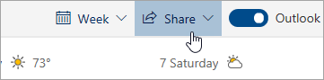

# การแชร์กับ Outlook บนเว็บ

จากปฏิทินของคุณ บนแถบเครื่องมือที่ด้านบนของหน้า ให้เลือก **แชร์**แล้วเลือกปฏิทินที่คุณต้องการแชร์

    

**หมายเหตุ**: คุณไม่สามารถแชร์ปฏิทินที่ผู้อื่นเป็นเจ้าของได้

- ป้อนชื่อหรือที่อยู่อีเมลของบุคคลที่คุณต้องการแชร์ปฏิทินด้วย
- เลือกวิธีที่คุณต้องการให้บุคคลนั้นใช้ปฏิทินของคุณ:
    - **สามารถดูเมื่อฉันไม่ว่าง**   ช่วยให้พวกเขาเห็นเมื่อคุณไม่ว่าง แต่ไม่ได้มีรายละเอียดเช่นสถานที่จัดกิจกรรม
    - **สามารถดูชื่อและตําแหน่งที่ตั้ง**   ช่วยให้พวกเขาเห็นเมื่อคุณไม่ว่างเช่นเดียวกับชื่อเรื่องและตําแหน่งของเหตุการณ์
    - **สามารถดูรายละเอียดทั้งหมด**   ช่วยให้พวกเขาเห็นรายละเอียดทั้งหมดของกิจกรรมของคุณ
    - **สามารถแก้ไข**   อนุญาตให้แก้ไขปฏิทินของคุณ
    - **ผู้รับมอบสิทธิ์**   อนุญาตให้พวกเขาแก้ไขปฏิทินของคุณและแบ่งปันกับผู้อื่น
- เลือก **แชร์**
