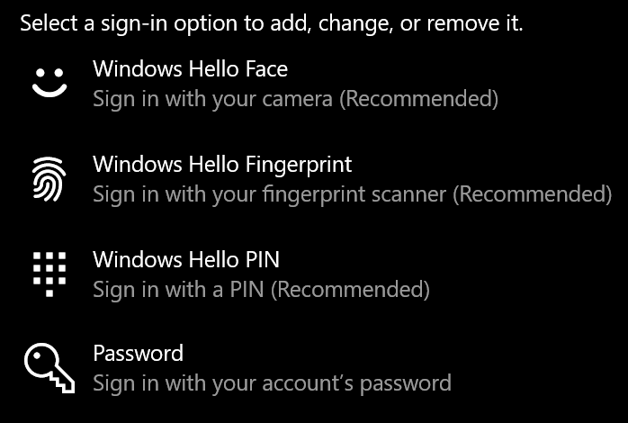
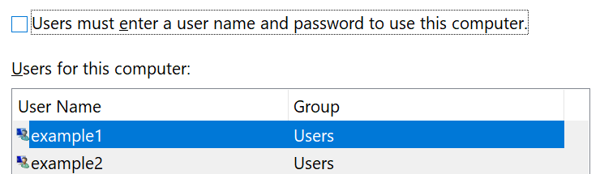

# ลงชื่อเข้าใช้ Windows 10 โดยไม่ใช้รหัสผ่าน

เมื่อต้องการหลีกเลี่ยงการพิมพ์รหัสผ่านที่ Windows เริ่มต้นเราขอแนะนำให้คุณใช้ตัวเลือกการลงชื่อเข้าใช้ Windows Hello ที่ปลอดภัยเช่น PIN การจดจำใบหน้าหรือลายนิ้วมือถ้าพร้อมใช้งาน ถ้าคุณต้องการปิดใช้งานการลงชื่อเข้าใช้ที่ปลอดภัยให้ดูที่คำแนะนำ "ลงชื่อเข้าใช้ Windows 10" โดยอัตโนมัติที่ด้านล่าง

**การรักษาความปลอดภัยของ Windows Hello ทางเลือกให้กับรหัสผ่านบัญชีผู้ใช้**

ไปที่ **การตั้งค่า > บัญชีผู้ใช้ > ตัวเลือกการลงชื่อเข้าใช้** (หรือคลิก [ที่นี่](ms-settings:signinoptions?activationSource=GetHelp)) ตัวเลือกการลงชื่อเข้าใช้ที่พร้อมใช้งานจะแสดงอยู่ในรายการ ตัวอย่างเช่น:

คลิกหรือแตะตัวเลือกใดตัวเลือกหนึ่งเพื่อกำหนดค่า ครั้งถัดไปที่คุณเริ่มหรือปลดล็อก Windows คุณจะสามารถใช้ตัวเลือกใหม่แทนรหัสผ่านได้ 

**ลงชื่อเข้าใช้ Windows 10 โดยอัตโนมัติ**

**หมายเหตุ**: การลงชื่อเข้าใช้โดยอัตโนมัติจะสะดวกแต่จะแนะนำความเสี่ยงด้านความปลอดภัยโดยเฉพาะอย่างยิ่งถ้าพีซีของคุณสามารถเข้าถึงได้โดยผู้ใช้หลายคน 

1. คลิกหรือแตะปุ่ม **เริ่มต้น** ในแถบงาน

2. พิมพ์ **netplwiz** แล้วกดแป้น Enter เพื่อเปิดหน้าต่างบัญชีผู้ใช้

3. ใน **บัญชีผู้ใช้**ให้คลิกบัญชีผู้ใช้ที่คุณต้องการลงชื่อเข้าใช้โดยอัตโนมัติเมื่อ Windows เริ่มต้นใช้งาน

4. ยกเลิกการเลือกกล่องกาเครื่องหมาย "ผู้ใช้ต้องใส่ชื่อผู้ใช้และรหัสผ่านเพื่อใช้คอมพิวเตอร์เครื่องนี้"

    

5. คลิก **OK** คุณจะถูกขอให้ใส่และยืนยันรหัสผ่านสำหรับบัญชีผู้ใช้ที่คุณเลือก คลิก **ตกลง** เพื่อเสร็จสิ้น ครั้งถัดไปที่ Windows 10 จะเริ่มการลงชื่อเข้าใช้บัญชีผู้ใช้ที่คุณเลือกไว้โดยอัตโนมัติ
