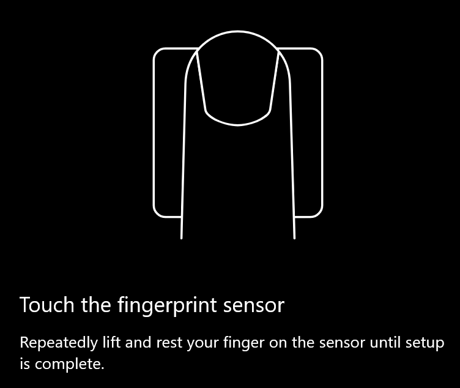
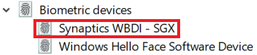

# ใช้ตัวเลือกการปลดล็อกลายนิ้วมือใน Windows 10Use fingerprint unlock option in Windows 10

**เปิดใช้งานการตรวจสอบลายนิ้วมือของ Windows Hello****Enable Windows Hello Fingerprint**

เมื่อต้องการปลดล็อก Windows 10 โดยใช้ลายนิ้วมือของคุณ คุณจะต้องตั้งค่าลายนิ้วมือของ Windows Hello โดยการเพิ่ม (เพื่อให้ Windows เรียนรู้การรู้รู้) อย่างน้อยหนึ่งนิ้วTo unlock Windows 10 using your fingerprint, you need to set up Windows Hello Fingerprint by adding (letting Windows learn to recognize) at least one finger. 

1. ไปที่ **การตั้งค่า >บัญชีผู้ใช้> ตัวเลือกการ** ลงชื่อเข้าใช้ (หรือ [คลิกที่นี่](ms-settings:signinoptions?activationSource=GetHelp))Go to **Settings  > Accounts > Sign-in options** (or click [here](ms-settings:signinoptions?activationSource=GetHelp)). ตัวเลือกการลงชื่อเข้าใช้ที่พร้อมใช้งานจะแสดงในรายการAvailable sign-in options will be listed. ตัวอย่างเช่น:For example:

    

2. คลิกหรือ **แตะ ลายนิ้วมือ** Windows Hello **แล้วคลิก** ตั้งค่าClick or tap **Windows Hello Fingerprint**, then click **Set up**. ในหน้าต่างการตั้งค่า Windows Hello **ให้คลิก** เริ่มต้นใช้งานIn the Windows Hello setup window, click **Get started**. เซนเซอร์ลายนิ้วมือจะเปิดใช้งาน และคุณจะถูกขอให้วางนิ้วของคุณบนเซ็นเซอร์:The fingerprint sensor will activate, and you'll be asked to place your finger on the sensor:

   

3. ให้ปฏิบัติตามคําแนะนํา ซึ่งจะขอให้คุณสแกนนิ้วซ้ําๆFollow the instructions, which will ask you to repeatedly scan your finger. เมื่อเสร็จสิ้น คุณจะมีตัวเลือกในการเพิ่มนิ้วอื่นๆ ที่คุณอาจต้องการใช้ในการลงชื่อเข้าใช้When this is finished, you'll have the option of adding other fingers you may want to use for sign-in. ในครั้งถัดไปที่คุณลงชื่อเข้าใช้ Windows 10 คุณจะมีตัวเลือกในการใช้ลายนิ้วมือเพื่อบันทึกNext time you sign in to Windows 10, you will have the option of using your fingerprint to do so.

**ลายนิ้วมือของ Windows Hello ไม่พร้อมใช้งานเป็นตัวเลือกการลงชื่อเข้าใช้****Windows Hello Fingerprint not available as a sign-in option**

ถ้าลายนิ้วมือของ Windows Hello ไม่ได้แสดงเป็นตัวเลือกในตัวเลือกการลงชื่อเข้าใช้ นั่นหมายความว่า Windows ไม่ทราบถึงตัวอ่าน/สแกนเนอร์ลายนิ้วมือที่ต่ออยู่กับพีซีของคุณ หรือนโยบายระบบป้องกันไม่ให้มีการใช้งาน (ตัวอย่างเช่น ถ้าพีซีของคุณถูกจัดการโดยที่ทํางานของคุณ)If Windows Hello Fingerprint is not shown as an option in **Sign-in options**, it means Windows is not aware of any fingerprint reader/scanner attached to your PC, or that a system policy prevents its use (if for example your PC is managed by your workplace). เมื่อต้องการแก้ไขปัญหา:To troubleshoot: 

1. เลือก **ปุ่ม** เริ่ม ในแถบงาน แล้วค้นหา **ตัวจัดการ** อุปกรณ์Select the **Start** button in the Taskbar and search for **Device Manager**.

2. คลิกหรือแตะเพื่อเปิด **ตัวจัดการ** อุปกรณ์Click or tap to open **Device Manager**.

3. ใน Device Manager ให้ขยายอุปกรณ์ชีวมาตรโดยคลิกที่เครื่องหมายบั้งIn Device Manager, expand Biometric devices by clicking its chevron.

   

4. ตัวสแกนลายนิ้วมือของคุณควรแสดงรายการเป็นอุปกรณ์ชีวมาตร เช่น ตัวสแกน Synaptics WBDI ดังนี้Your fingerprint scanner should be listed as a biometric device, such as the Synaptics WBDI scanner:

   

5. ถ้าตัวสแกนลายนิ้วมือของคุณไม่แสดงขึ้น และสแกนเนอร์ถูกรวมเข้ากับพีซีของคุณ ให้ไปที่เว็บไซต์ของผู้ผลิตพีซีIf your fingerprint scanner is not shown, and the scanner is integrated into your PC, go to the PC manufacturer's website. ในส่วนการสนับสนุนทางเทคนิคของรุ่นพีซีของคุณ ให้ค้นหาโปรแกรมควบคุม Windows 10 เพื่อสแกนที่คุณสามารถติดตั้งได้In the technical support section for your PC model, search for a Windows 10 driver for a scanner that you can install.

6. ถ้าสแกนเนอร์แยกจากพีซี (ต่อผ่าน USB) ไปที่เว็บไซต์ของผู้ผลิตสแกนเนอร์เพื่อค้นหาและติดตั้งซอฟต์แวร์โปรแกรมควบคุมอุปกรณ์ Windows 10 ของรุ่นสแกนเนอร์ที่คุณมีIf the scanner is separate from the PC (attached via USB), go to the scanner manufacturer's website to find and install Windows 10 device driver software for the scanner model you have.
