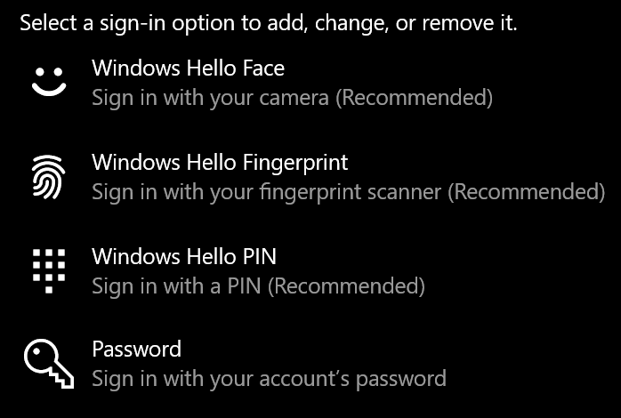

# ใช้ตัวเลือกการปลดล็อกลายนิ้วมือใน Windows 10

**เปิดใช้งานการตรวจสอบลายนิ้วมือของ Windows Hello**

เมื่อต้องการปลดล็อก Windows 10 โดยใช้ลายนิ้วมือของคุณ คุณจะต้องตั้งค่าลายนิ้วมือของ Windows Hello โดยการเพิ่ม (เพื่อให้ Windows เรียนรู้การรู้รู้) อย่างน้อยหนึ่งนิ้ว 

1. ไปที่ **การตั้งค่า >บัญชีผู้ใช้> ตัวเลือกการ** ลงชื่อเข้าใช้ (หรือ [คลิกที่นี่](ms-settings:signinoptions?activationSource=GetHelp)) ตัวเลือกการลงชื่อเข้าใช้ที่พร้อมใช้งานจะแสดงในรายการ ตัวอย่างเช่น:

    

2. คลิกหรือ **แตะ ลายนิ้วมือ** Windows Hello **แล้วคลิก** ตั้งค่า ในหน้าต่างการตั้งค่า Windows Hello **ให้คลิก** เริ่มต้นใช้งาน เซนเซอร์ลายนิ้วมือจะเปิดใช้งาน และคุณจะถูกขอให้วางนิ้วของคุณบนเซ็นเซอร์:

   

3. ให้ปฏิบัติตามคําแนะนํา ซึ่งจะขอให้คุณสแกนนิ้วซ้ําๆ เมื่อเสร็จสิ้น คุณจะมีตัวเลือกในการเพิ่มนิ้วอื่นๆ ที่คุณอาจต้องการใช้ในการลงชื่อเข้าใช้ ในครั้งถัดไปที่คุณลงชื่อเข้าใช้ Windows 10 คุณจะมีตัวเลือกในการใช้ลายนิ้วมือเพื่อบันทึก

**ลายนิ้วมือของ Windows Hello ไม่พร้อมใช้งานเป็นตัวเลือกการลงชื่อเข้าใช้**

ถ้าลายนิ้วมือของ Windows Hello ไม่ได้แสดงเป็นตัวเลือกในตัวเลือกการลงชื่อเข้าใช้ นั่นหมายความว่า Windows ไม่ทราบถึงตัวอ่าน/สแกนเนอร์ลายนิ้วมือที่ต่ออยู่กับพีซีของคุณ หรือนโยบายระบบป้องกันไม่ให้มีการใช้งาน (ตัวอย่างเช่น ถ้าพีซีของคุณถูกจัดการโดยที่ทํางานของคุณ) เมื่อต้องการแก้ไขปัญหา: 

1. เลือก **ปุ่ม** เริ่ม ในแถบงาน แล้วค้นหา **ตัวจัดการ** อุปกรณ์

2. คลิกหรือแตะเพื่อเปิด **ตัวจัดการ** อุปกรณ์

3. ใน Device Manager ให้ขยายอุปกรณ์ชีวมาตรโดยคลิกที่เครื่องหมายบั้ง

   

4. ตัวสแกนลายนิ้วมือของคุณควรแสดงรายการเป็นอุปกรณ์ชีวมาตร เช่น ตัวสแกน Synaptics WBDI ดังนี้

   

5. ถ้าตัวสแกนลายนิ้วมือของคุณไม่แสดงขึ้น และสแกนเนอร์ถูกรวมเข้ากับพีซีของคุณ ให้ไปที่เว็บไซต์ของผู้ผลิตพีซี ในส่วนการสนับสนุนทางเทคนิคของรุ่นพีซีของคุณ ให้ค้นหาโปรแกรมควบคุม Windows 10 เพื่อสแกนที่คุณสามารถติดตั้งได้

6. ถ้าสแกนเนอร์แยกจากพีซี (ต่อผ่าน USB) ไปที่เว็บไซต์ของผู้ผลิตสแกนเนอร์เพื่อค้นหาและติดตั้งซอฟต์แวร์โปรแกรมควบคุมอุปกรณ์ Windows 10 ของรุ่นสแกนเนอร์ที่คุณมี
