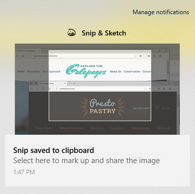

# ใช้ส&ปในภาพร่างเพื่อจับภาพ มาร์กอัป และแชร์รูปภาพ

ภาพร่างบนหน้าจอจะเรียกว่า **สนิ&ภาพ** ร่าง **เมื่อต้องการสนิปอย่างรวดเร็ว**:

1. กด Windows **โลโก้ + Shift + S** คุณจะเห็นหน้าจอของคุณมืดลงและเคอร์เซอร์ของคุณแสดงเป็นกากบาท 

2. เลือกจุดที่ขอบของพื้นที่ที่คุณต้องการคัดลอก แล้วคลิกซ้ายที่เคอร์เซอร์ 

3. ย้ายเคอร์เซอร์ของคุณเพื่อเน้นพื้นที่ที่คุณต้องการจับภาพ พื้นที่ที่คุณจับภาพจะปรากฏบนหน้าจอของคุณ

   

รูปภาพที่คุณสนิปจะถูกบันทึกไว้ในคลิปบอร์ดของคุณพร้อมแล้วที่จะวางลงในอีเมลหรือเอกสาร 

**ถ้าคุณต้องการแก้ไขหรือดูรูปภาพ**: 

- คลิกไอคอนการแจ้งเตือนทางด้านขวาสุดของแถบงาน จากนั้นคลิกรูปภาพที่คุณเพิ่งถ่าย สนิปของคุณจะเปิดขึ้นในแอปส&ปในแอปภาพร่าง

   
