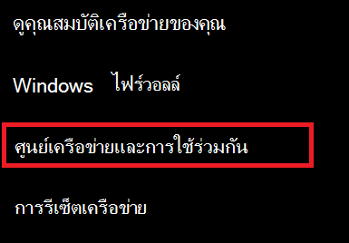
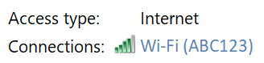
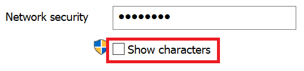

# ดูรหัสผ่านเครือข่าย Wi-fi ใน Windows 10

1. ตรวจสอบให้แน่ใจว่าพีซี Windows 10 ของคุณเชื่อมต่อกับเครือข่าย Wi-fi แล้ว

2. ไปที่การ **ตั้งค่า > เครือข่าย & สถานะ > อินเทอร์เน็ต**หรือคลิกหรือแตะ [ที่นี่](ms-settings:network?activationSource=GetHelp) เพื่อแจ้งให้เราใช้งานได้ทันที)

3. คลิก**ศูนย์เครือข่ายและการใช้ร่วมกัน**

    

4. ใน **ศูนย์เครือข่ายและการใช้ร่วมกัน**ที่อยู่ถัดจากการ **เชื่อมต่อ**คุณจะเห็นชื่อเครือข่ายไร้สายของคุณ ตัวอย่างเช่นถ้าเครือข่ายของคุณมีชื่อว่า "ABC123" คุณอาจเห็น:

    

    คลิกชื่อเครือข่ายไร้สายเพื่อเปิดหน้าต่างสถานะ Wi-fi 

5. ในหน้าต่างสถานะ Wi-fi ให้คลิก**คุณสมบัติแบบไร้สาย**คลิกแท็บ**ความปลอดภัย**แล้วเลือก**แสดงอักขระ**

    

